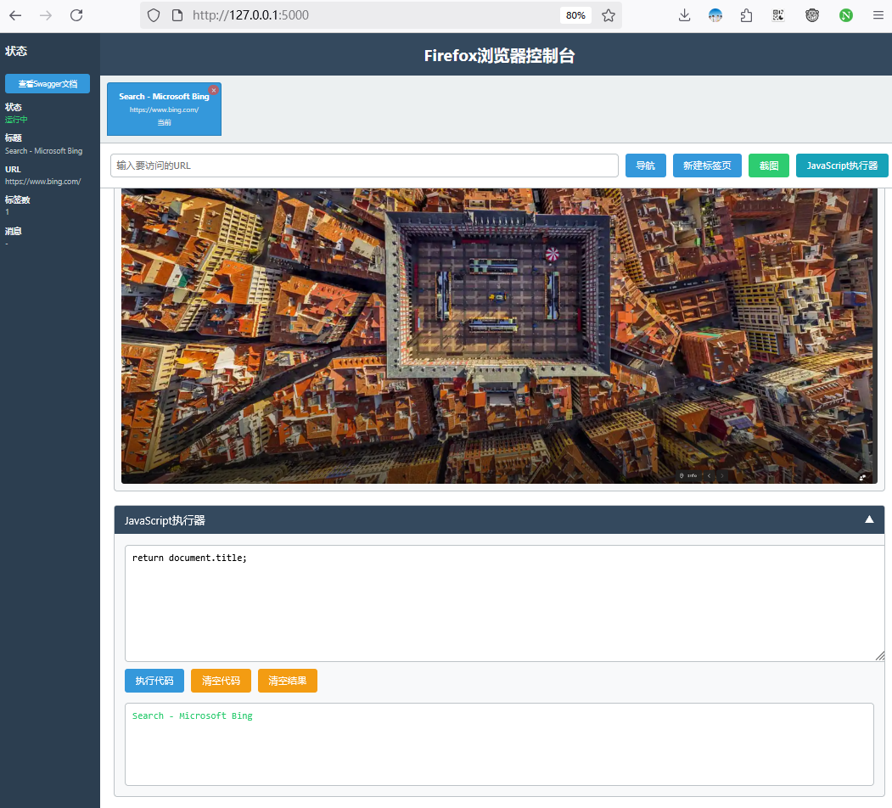

# Windows Docker Firefox API

基于Windows容器的Firefox浏览器API服务，提供浏览器控制功能。



## 功能

- 浏览器控制（启动、退出）
- 截图功能
- 标签页管理（打开、关闭、切换）
- 页面导航
- JavaScript执行

## 快速开始

1. 切换Docker到Windows容器模式
2. 构建并运行：

   ```bash
   docker-compose up --build
   ```

3. 访问 http://localhost:5000/docs 查看API文档

## API文档

访问 http://localhost:5000 查看完整的API文档和交互式测试界面。

## 技术栈

- FastAPI
- Selenium
- Firefox
- Windows容器

## 项目结构

```
windows-firefox-docker/
├── app.py              # 主应用
├── Dockerfile          # 容器配置
├── docker-compose.yml  # 部署配置
├── requirements.txt    # 依赖管理
├── templates/
│   └── index.html     # Web界面
└── README.md          # 项目文档
